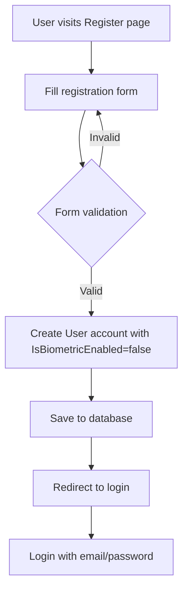
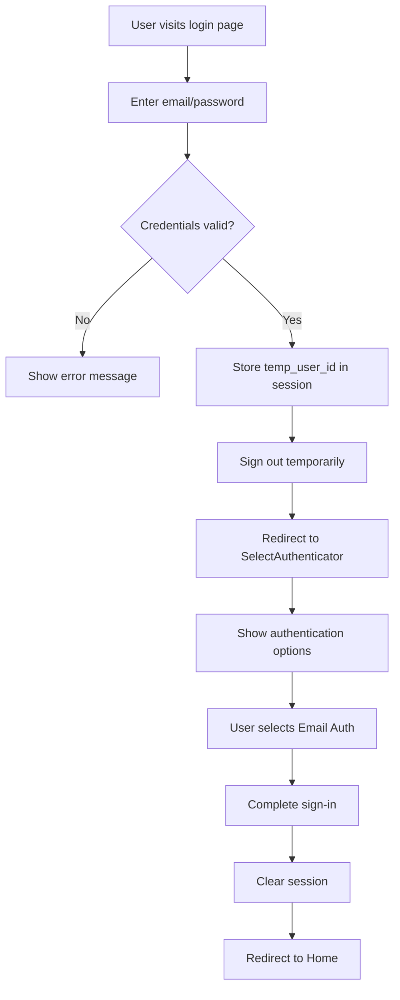
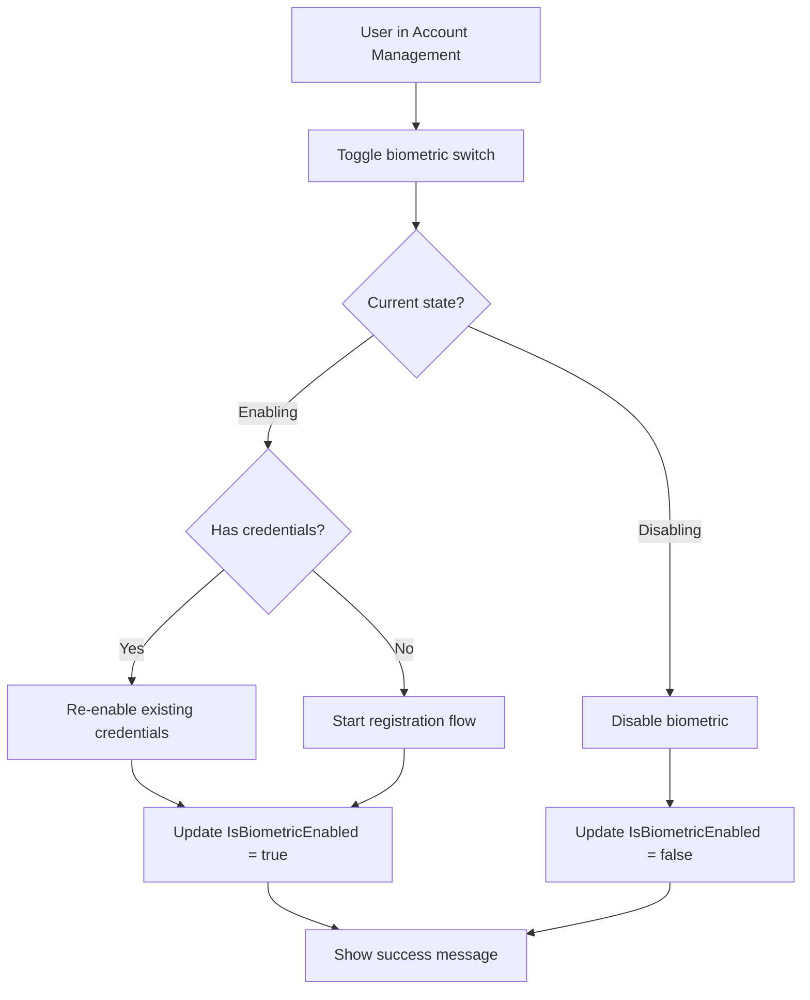

# Biometric Authentication System - Comprehensive Business Flow Documentation

## Overview

This documentation provides a complete business flow analysis of the ASP.NET Core biometric authentication system that implements WebAuthn/FIDO2 standards for passwordless authentication. The system supports fingerprint, face recognition, hardware security keys, and other biometric authenticators.

## Table of Contents

1. [System Architecture](#system-architecture)
2. [User Registration Flow](#user-registration-flow)
3. [Biometric Registration Flow](#biometric-registration-flow)
4. [Authentication Flows](#authentication-flows)
5. [Account Management](#account-management)
6. [Database Schema](#database-schema)
7. [Security Considerations](#security-considerations)
8. [Implementation Guide](#implementation-guide)
9. [API Endpoints](#api-endpoints)
10. [Error Handling](#error-handling)

---

## System Architecture

### Core Components

#### Backend Components
- **ASP.NET Core Identity**: User management and authentication
- **Fido2NetLib**: WebAuthn/FIDO2 implementation
- **Entity Framework Core**: Database ORM
- **SQL Server**: Database storage

#### Frontend Components
- **Razor Pages**: Server-side rendering
- **Bootstrap**: UI framework
- **WebAuthn JavaScript API**: Client-side biometric operations
- **Custom FIDO2.js**: WebAuthn integration layer

#### Key Models
- **User**: Extended IdentityUser with biometric properties
- **Fido2Credential**: Stores WebAuthn credentials
- **ApplicationDbContext**: Database context

---

## User Registration Flow

### 1. Initial User Registration



**Business Steps:**
1. User navigates to `/Account/Register`
2. User provides:
   - Email address (username)
   - Display name
   - Password
   - Password confirmation
3. System validates form data
4. System creates User record with:
   - `IsBiometricEnabled = false` (default - users must opt-in)
   - No FIDO2 credentials initially
5. User redirected to login page

**Code Location:** `Pages/Account/Register.cshtml.cs`

---

## Biometric Registration Flow

### 2. Biometric Credential Registration

```mermaid
graph TD
    A[User logs in] --> B[Navigate to Account Management]
    B --> C[Toggle biometric switch]
    C --> D{Has existing credentials?}
    D -->|Yes| E[Toggle enabled/disabled]
    D -->|No| F[Show Terms & Conditions]
    F --> G[User accepts terms]
    G --> H[Show password verification modal]
    H --> I[User enters password]
    I --> J{Password valid?}
    J -->|No| I
    J -->|Yes| K[Generate credential creation options]
    K --> L[Call navigator.credentials.create()]
    L --> M{Biometric available?}
    M -->|No| N[Show error message]
    M -->|Yes| O[User performs biometric gesture]
    O --> P{Gesture successful?}
    P -->|No| N
    P -->|Yes| Q[Send attestation to server]
    Q --> R[Verify and store credential]
    R --> S[Set IsBiometricEnabled = true]
    S --> T[Show success message]
```

**Detailed Business Steps:**

#### 2.1 Initiate Registration
1. User logs in with email/password
2. User navigates to `/Account/Manage`
3. User sees biometric toggle switch (initially off if no credentials)
4. User clicks toggle to enable biometric authentication

#### 2.2 Terms and Conditions
1. System displays terms and conditions modal
2. Terms include:
   - Biometric data collection notice
   - Data security information
   - Device binding explanation
   - Revocation rights
   - Backup access requirements

#### 2.3 Password Verification
1. System shows password verification modal
2. User enters current password
3. POST request to `/Account/Manage?handler=VerifyPasswordAndStartRegistration`
4. System validates password using `UserManager.CheckPasswordAsync()`

#### 2.4 Credential Creation
1. Server generates `CredentialCreateOptions`:
   ```csharp
   var options = _fido2.RequestNewCredential(
       new Fido2User { 
           Id = user.Fido2Id, 
           Name = user.UserName, 
           DisplayName = user.DisplayName 
       },
       existingCredentials,
       authenticatorSelection,
       AttestationConveyancePreference.None
   );
   ```

2. Client receives options and calls WebAuthn API:
   ```javascript
   const credential = await navigator.credentials.create({
       publicKey: options
   });
   ```

#### 2.5 Biometric Capture
1. Browser prompts for biometric authentication
2. User performs biometric gesture (fingerprint, face, etc.)
3. Device generates cryptographic key pair
4. Private key stored securely on device
5. Public key and attestation returned to application

#### 2.6 Credential Storage
1. Client sends attestation response to server
2. POST request to `/Account/Manage?handler=CompleteRegistration`
3. Server verifies attestation using FIDO2 library
4. Server creates `Fido2Credential` record:
   ```csharp
   var credential = new Fido2Credential
   {
       UserId = user.Id,
       PublicKey = result.Result.PublicKey,
       UserHandle = attestationResponse.Id,
       SignatureCounter = result.Result.Counter,
       CredType = result.Result.CredType,
       RegDate = DateTime.Now,
       AaGuid = result.Result.Aaguid
   };
   ```
5. Server sets `user.IsBiometricEnabled = true`

**Code Locations:**
- Frontend: `wwwroot/js/fido2.js`
- Backend: `Pages/Account/Manage.cshtml.cs`
- Service: `Services/WebAuthnService.cs`

---

## Authentication Flows

### 3. Password-First Authentication Flow



**Business Steps:**
1. User navigates to `/` (Index page)
2. User enters email and password
3. System validates credentials using ASP.NET Core Identity
4. If valid:
   - Store user ID in session (`temp_user_id`)
   - Temporarily sign out user
   - Redirect to `/SelectAuthenticator`
5. User chooses "Email Authentication"
6. System completes sign-in process
7. User redirected to protected area

### 4. Biometric-First Authentication Flow (Passwordless)

```mermaid
graph TD
    A[User visits login page] --> B[Click biometric login button]
    B --> C[Generate assertion options]
    C --> D[Call navigator.credentials.get()]
    D --> E{Biometric available?}
    E -->|No| F[Show error message]
    E -->|Yes| G[User performs biometric gesture]
    G --> H{Gesture successful?}
    H -->|No| F
    H -->|Yes| I[Send assertion to server]
    I --> J[Verify signature]
    J --> K{Signature valid?}
    K -->|No| F
    K -->|Yes| L[Find user by credential]
    L --> M{User found & biometric enabled?}
    M -->|No| F
    M -->|Yes| N[Store temp_user_id]
    N --> O[Redirect to SelectAuthenticator]
    O --> P[User selects final auth method]
    P --> Q[Complete sign-in]
    Q --> R[Redirect to Home]
```

**Detailed Business Steps:**

#### 4.1 Initiate Biometric Login
1. User navigates to login page
2. User clicks biometric/passkey button (fingerprint icon)
3. JavaScript calls `/Account/Login?handler=GetAssertionOptionsUsernameless`
4. Server generates assertion options without requiring username

#### 4.2 Biometric Authentication
1. Client calls WebAuthn API:
   ```javascript
   const credential = await navigator.credentials.get({
       publicKey: options
   });
   ```
2. Browser prompts for biometric authentication
3. User performs biometric gesture
4. Device uses stored private key to sign challenge
5. Assertion response returned to application

#### 4.3 Server Verification
1. Client sends assertion to server
2. Server looks up credential by `UserHandle`
3. Server finds associated user
4. Server verifies:
   - User exists and is active
   - `IsBiometricEnabled = true`
   - Signature is valid using stored public key
   - Challenge matches session data

#### 4.4 Authentication Completion
1. If verification successful:
   - Store user ID in session
   - Redirect to SelectAuthenticator page
2. User chooses final authentication method
3. System completes sign-in process

**Code Locations:**
- Frontend: `wwwroot/js/fido2.js` (login-usernameless event)
- Backend: `Pages/Index.cshtml.cs`, `Pages/Account/Login.cshtml.cs`
- Service: `Services/WebAuthnService.cs` (CompleteAssertionAsync)

---

## Account Management

### 5. Biometric Toggle Management



**Business Logic:**

#### 5.1 Enable Biometric
- **With existing credentials**: Simply set `IsBiometricEnabled = true`
- **Without credentials**: Trigger full registration flow

#### 5.2 Disable Biometric
- Set `IsBiometricEnabled = false`
- **Important**: Credentials are preserved, not deleted
- User can re-enable without re-registering

**Code Location:** `Pages/Account/Manage.cshtml.cs` (OnPostToggleBiometricAsync)

---

## Database Schema

### 6. Data Models

#### 6.1 User Model (extends IdentityUser)
```csharp
public class User : IdentityUser
{
    public byte[]? Fido2Id { get; set; }                    // FIDO2 user identifier
    public string? DisplayName { get; set; }                // User display name
         public bool IsBiometricEnabled { get; set; } = false;   // Biometric toggle flag (opt-in)
    public virtual ICollection<Fido2Credential> Fido2Credentials { get; set; }
}
```

#### 6.2 Fido2Credential Model
```csharp
public class Fido2Credential
{
    public int Id { get; set; }                    // Primary key
    public string UserId { get; set; }             // Foreign key to User
    public byte[]? PublicKey { get; set; }         // WebAuthn public key
    public byte[]? UserHandle { get; set; }        // WebAuthn user handle
    public uint SignatureCounter { get; set; }     // Replay attack prevention
    public string? CredType { get; set; }          // Credential type
    public DateTime RegDate { get; set; }          // Registration date
    public Guid AaGuid { get; set; }               // Authenticator GUID
    public virtual User User { get; set; }         // Navigation property
}
```

#### 6.3 Database Relationships
- One-to-Many: User → Fido2Credentials
- Unique constraint on User.Fido2Id
- Required foreign key relationship

**Migration Files:**
- `20250704105024_InitialCreate.cs`
- `20250708095233_AddIsBiometricEnabledToUser.cs`

---

## Security Considerations

### 7. Security Features

#### 7.1 WebAuthn Security
- **Public Key Cryptography**: Private keys never leave device
- **Origin Binding**: Credentials tied to specific domain
- **Replay Protection**: Signature counters prevent replay attacks
- **User Verification**: Biometric or PIN required

#### 7.2 Session Security
- **Anti-Forgery Tokens**: CSRF protection on all forms
- **Secure Cookies**: HttpOnly and Secure flags
- **Session Timeout**: 60-minute idle timeout
- **Temporary Sessions**: Pre-auth user IDs for multi-step flows

#### 7.3 Data Protection
- **Encrypted Storage**: Biometric data stays on device
- **Minimal Server Storage**: Only public keys and metadata stored
- **User Control**: Users can disable/enable biometric auth
- **Backup Access**: Password authentication always available

#### 7.4 FIDO2 Configuration
```csharp
builder.Services.AddFido2(options =>
{
    options.ServerDomain = "localhost";  // Production: actual domain
    options.ServerName = "Fido2-net-lib simple example";
    options.Origins = new HashSet<string> { "https://localhost:7253" };
});
```

---

## Implementation Guide

### 8. For New Projects

#### 8.1 Required Dependencies
```xml
<PackageReference Include="Fido2.NetFramework" Version="3.0.1" />
<PackageReference Include="Microsoft.AspNetCore.Identity.EntityFrameworkCore" Version="8.0.0" />
<PackageReference Include="Microsoft.EntityFrameworkCore.SqlServer" Version="8.0.0" />
```

#### 8.2 Service Registration
```csharp
// Program.cs
builder.Services.AddDbContext<ApplicationDbContext>(options =>
    options.UseSqlServer(connectionString));

builder.Services.AddIdentity<User, IdentityRole>()
    .AddEntityFrameworkStores<ApplicationDbContext>()
    .AddDefaultTokenProviders();

builder.Services.AddFido2(options => {
    options.ServerDomain = builder.Configuration["fido2:serverDomain"];
    options.ServerName = "Your App Name";
    options.Origins = new HashSet<string> { builder.Configuration["fido2:origin"] };
});

builder.Services.AddScoped<IWebAuthnService, WebAuthnService>();
```

#### 8.3 Database Setup
1. Create models (User, Fido2Credential)
2. Configure DbContext relationships
3. Run migrations:
   ```bash
   dotnet ef migrations add InitialCreate
   dotnet ef database update
   ```

#### 8.4 Frontend Integration
1. Include WebAuthn JavaScript APIs
2. Implement FIDO2 helper functions
3. Add biometric UI components
4. Handle browser compatibility

### 8.5 Configuration Requirements
```json
{
  "fido2": {
    "serverDomain": "yourdomain.com",
    "origin": "https://yourdomain.com"
  },
  "ConnectionStrings": {
    "DefaultConnection": "Server=...;Database=...;"
  }
}
```

---

## API Endpoints

### 9. WebAuthn Endpoints

#### 9.1 Registration Endpoints
- **POST** `/Account/Manage?handler=VerifyPasswordAndStartRegistration`
  - Verifies password and initiates credential creation
  - Returns: `CredentialCreateOptions`

- **POST** `/Account/Manage?handler=CompleteRegistration`
  - Completes credential registration
  - Input: `AuthenticatorAttestationRawResponse`
  - Returns: Registration result

- **POST** `/Account/Manage?handler=ToggleBiometric`
  - Enables/disables biometric authentication
  - Returns: Status and message

#### 9.2 Authentication Endpoints
- **POST** `/?handler=GetAssertionOptionsUsernameless`
- **POST** `/Account/Login?handler=GetAssertionOptionsUsernameless`
  - Gets assertion options for passwordless login
  - Returns: `AssertionOptions`

- **POST** `/?handler=MakeAssertion`
- **POST** `/Account/Login?handler=MakeAssertion`
  - Completes biometric authentication
  - Input: `AuthenticatorAssertionRawResponse`
  - Returns: Authentication result

#### 9.3 Authentication Flow Endpoints
- **GET/POST** `/` - Main login page
- **GET/POST** `/Account/Login` - Alternative login page
- **GET/POST** `/Account/Register` - User registration
- **GET/POST** `/SelectAuthenticator` - Authentication method selection
- **GET** `/Account/Manage` - Account management
- **GET** `/Home` - Protected dashboard

---

## Error Handling

### 10. Common Error Scenarios

#### 10.1 Registration Errors
```javascript
// Client-side errors
"Server response missing challenge property"
"Server response missing user.id property"
"An error occurred during registration"

// Server-side errors
"Username is required"
"User not found"
"Invalid password. Please try again."
```

#### 10.2 Authentication Errors
```javascript
// Client-side errors
"Server returned an error"
"Login failed: [error message]"

// Server-side errors
"Credential not found"
"Biometric authentication is disabled for this user"
"Assertion options not found in session"
```